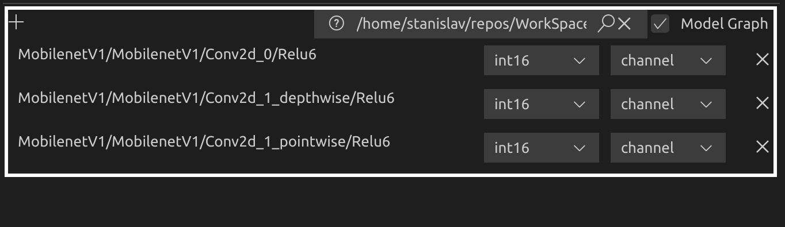

# MixedPrecisionQantizationEditor (MPQEditor for short)

## About

MPQEditor povides easy way of creation/editing MPQ json files, suitable for 
Quantization step in CfgEditor. Also it gives the ability to select the most 
sensitive to quantization layers using `visq` data. 

## How to use

Currently MPQEditor is integrated into EXPLORER view by context menu item
"Create MPQ json".

In order to use it:
1) call context menu for a `.circle` model in EXPLORER view
2) call "Create MPQ json"
3) give a name to MPQ json
4) edit MPQ json using MPQEditor
5) all layers from 'layers' section in json are shown in grid-table, so 
that their options for quantization can be edited using their respective 
dropdowns. Layers which don't belong to 'layers' section will be quantized 
using default parameters.
6) to make 'model-graph-view' more informative the user may use 'visq' 
information, it shows which layers are more sensitive to quantization than
others

## Screen layout
Layout is divided into three main parts:
1) Default Quantization Parameters

2) 'Layers' section

3) Model graph view

### Layers section 

1. `Add more layers`
    - use it to add more layers for editing their quantization properties
2. `VISQ control`
    - info
    - actual path
    - 'load visq' button
    - 'clear visq' button
3. `Model graph is shown/hidden`
    - use this to enable selection on `Model graph view`
4. `Individual layer`
    - it consists of quantization properties set for each layer 
5. `Quantization properties of layer`
    - quantization and granularity fields for each layer
6. `Restore layer`
    - use it to restore the layer to default state

For the whole workflow see:

 

