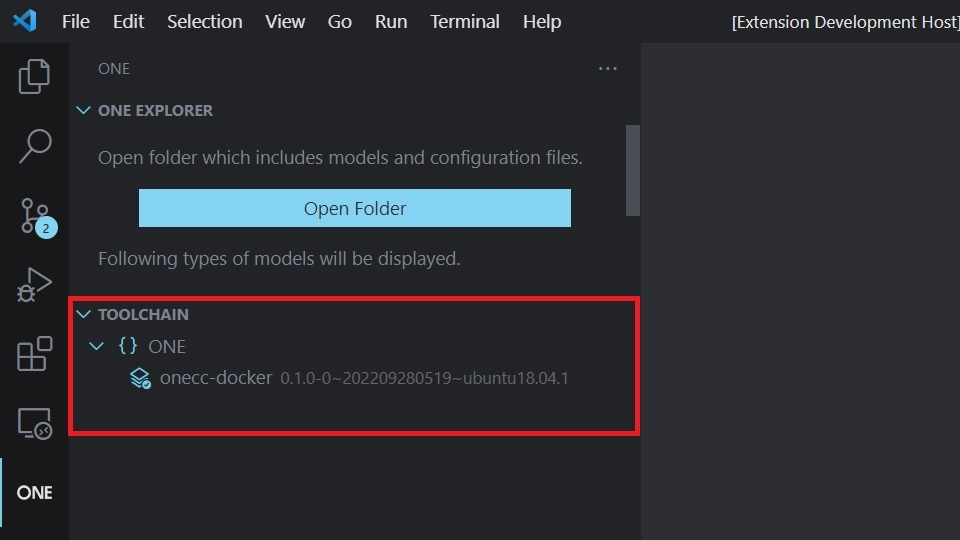
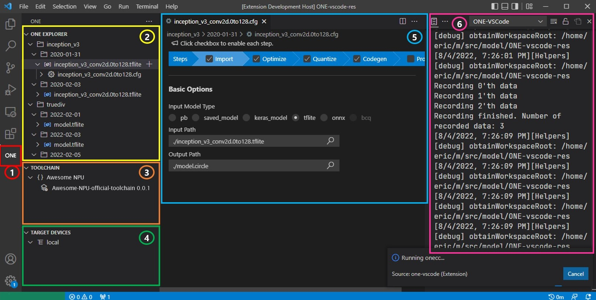
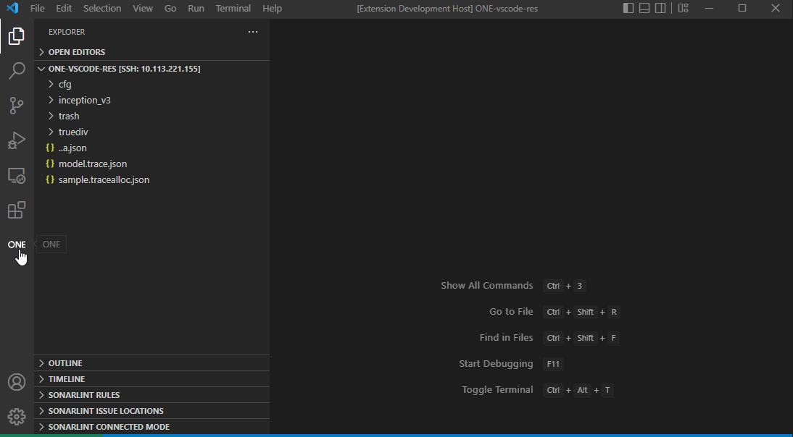

# Tutorial

## Table of Contents
- [How to install ONE-vscode](#how-to-install-one-vscode)
- [Screen layout](#screen-layout)
- [Workspace](#workspace)
- [Install a toolchain](#install-a-toolchain)
- [Set default toolchain](#set-default-toolchain)
- [Prepare a model and a config file](#prepare-a-model-and-a-config-file)
- [Compile a model](#compile-a-model)
- [Profile a model](#profile-a-model)
- [Contact](#contact)

## How to install ONE-vscode

### Install vscode

ONE-vscode is an [extension](https://code.visualstudio.com/docs/editor/extension-marketplace) of [vscode](https://code.visualstudio.com/). To use ONE-vscode, you should install vscode first.

### Development environment

ONE-vscode supports one of the following development environments:
1. A single Ubuntu machine (to run vscode and ONE toolchains)
2. A Windows machine (to run vscode) and a Ubuntu machine (to run ONE toolchains), connected with SSH extension

A Ubuntu machine is mandatory because [ONE](https://github.com/Samsung/ONE) is officially released on Ubuntu. If your development environment is vscode on Windows, you need additional Ubuntu machine to run ONE toolchain. In addition, you need to [install SSH extension in vscode](https://code.visualstudio.com/docs/remote/ssh-tutorial).

### Install ONE-vscode extension

You can download the official extension package at [ONE-vscode release page](https://github.com/Samsung/ONE-vscode/releases), of which file extension is `*.vsix`.

Then, install ONE-vscode extension by [following this instruction](https://code.visualstudio.com/docs/editor/extension-marketplace#_install-from-a-vsix).

### Install backend extension(s)

If you want to compile your model into a code for, e.g., a specific model of NPU, GPU or DSP, you need to use backend extension(s) built for such chipset. In that case, you need to contact the vendor or developer who provides specific backend extension and get the backend extension.

Backend extension should be installed _after_ installing ONE-vscode extension.

### Use ONE-vscode without any backend extension
ONE-vscode supports `ONE` backend by default. This requires [Docker Installation](https://docs.docker.com/desktop/install/ubuntu/) and [root privileges](https://docs.docker.com/engine/install/linux-postinstall/). However it supports only basic compilation. If you want to compile for a specific hardware model, please install backend extensions.

### Build from source

For developers who want to build the latest extension file by themselves, read [How To Build From Source](./HowToBuildFromSource.md) document.

## Screen layout

ONE-vscode has 6 screen components.

1. `ONE icon`
    - Clicking this will load ONE-vscode extension into vscode
2. `ONE Explorer view`
    - This shows a tree view containing models and related files.
        - Model files (e.g., *.tflite, *.pb, *.onnx, etc) are shown in the directory structure.
        - Under each model file, ONE *.cfg that accepts the model file as input will be shown.
        - Under each *.cfg file, any files generated by running `onecc` with the *.cfg will be shown. For example, `*.circle` file and files after backend codegen.
3. `Toolchain view`
    - This shows a tree view of installed toolchains.
    - You can also install a new toolchain or uninstall an existing toolchain.
4. `Target Device view`
    - This shows a tree view of devices or simulators that can run for inference.
5. `ONE cfg editor`
    - This provides easier way to edit a ONE cfg file.
6. `ONE-vscode Log`
    - This shows logs. You can check detailed reason of error or warning.

## Workspace

You need to open a folder (`File > Open Folder` menu) to start with ONE-vscode. After opening a folder, a [_workspace_ is constructed by vscode.](https://code.visualstudio.com/docs/editor/workspaces).

The folder for ONE-vscode needs to have the following files:
- Your model files
  - TensorFlow model file(*.pb, saved model or Keras model)
  - TensorFlow Lite model (*.tflite)
  - ONNX model (*.onnx)
- ONE *.cfg files (You can create this file later)

## Install a toolchain

A toolchain contains [ONE command tools](https://github.com/Samsung/ONE/tree/master/compiler/one-cmds) and other backend-specific tools. Developers or vendors of backend can distribute backend-specific toolchain and put installation feature inside their backend extension.

To install a backend-specific toolchain, you first need to install the backend extension. Then, click `+` icon on the Toolchain view. You can also easily remove installed toolchain by clicking `X` icon in the Toolchain view.

## Set default toolchain

You can install multiple instances of toolchains. For example, some backend supports multiple versions of toolchain to be installed. Or you might installed more than one backend extensions installed and installed one or more toolchain per backend extension.

To execute a toolchain with a config file in the ONE explorer to, e.g., compile a model, you need to specify the default toolchain. Default toolchain refers to which toolchain you will use to run ONE related tools. To specify a default toolchain, if you mouse up the toolchain item you want to use in the Toolchain view, :heavy_check_mark: icon appears. Click this icon to specify it as default toolchain.

## Prepare a model and a config file

Now, let's try to compile  a model (TensorFlow Lite, TensorFlow, or ONNX).

Just like you might write _Makefile_ for C program, you need ONE `*.cfg` file to compile a model. ONE cfg file is a file that describes steps and options of compilation.
One example you can get is in [res/modelDir/truediv](../res/modelDir/truediv/). You may want to copy and modify the cfg file to your workspace. After modifying the cfg file to have your model file as input model, you will see the cfg file below your model file in ONE explorer.

You can also edit the cfg file with GUI cfg editor.

## Compile a model

Now, you can compile the model by clicking `▶` icon on a cfg file. Below a cfg file in ONE explorer, you can find generated files by compilation, e.g., various `*.circle` file and the final target file compiled for your backend.

## Profile a model

You can add `Profile` step into a cfg file, which will generate a json file in Chrome Tracing format, which has timeline data.
You can find the json file below the cfg file in ONE explorer. ONE-vscode provides embedded GUI viewer to see the json file.

## Contact

When you encounter any bug or problem, feel free to write a post in [issue page of ONE-vscode](https://github.com/Samsung/ONE-vscode/issues). Any idea or suggestion that could enhance ONE-vscode will also be welcome!
