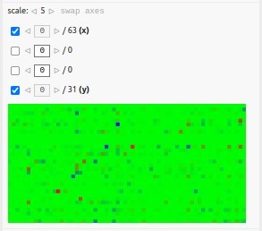
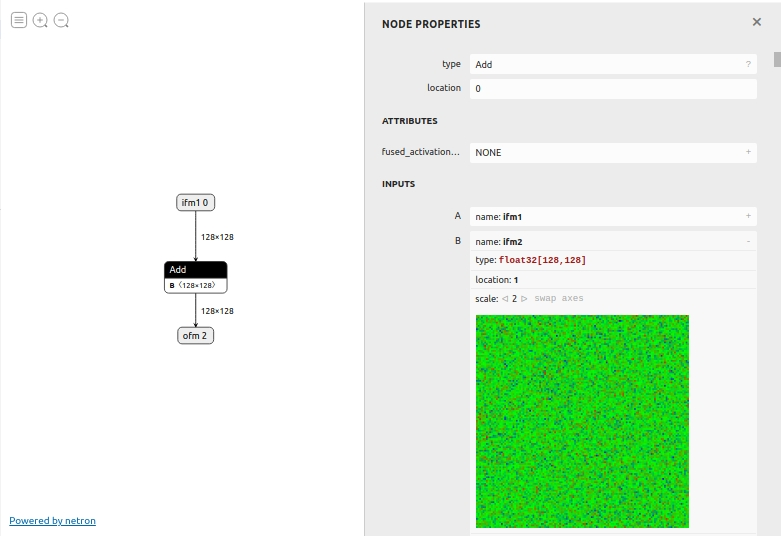
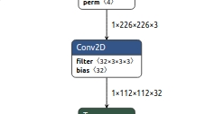
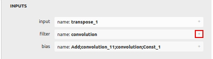
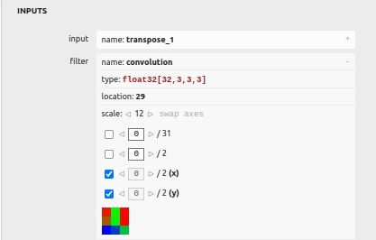
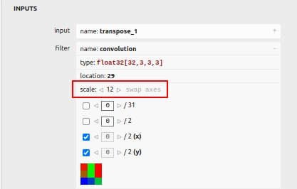
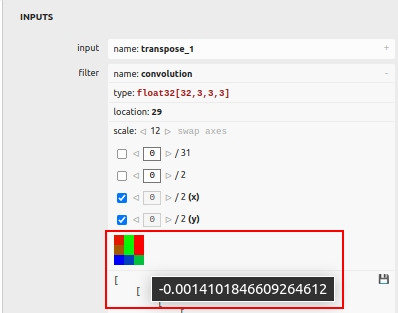
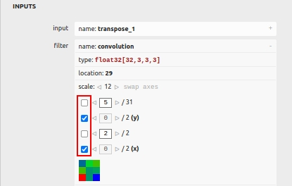
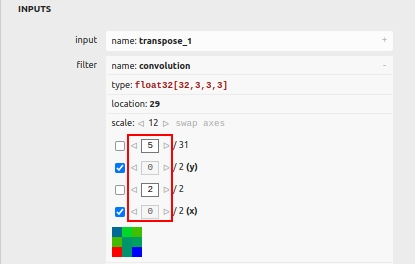

# Visual Tensor View

## Table of Contents
- [About](#about)
- [How to use](#how-to-use)

## About

Visual Tensor View is a tool that alows to visualize tensor data as a 2D-heatmap.

## How to use

Currently Visual Tensor View is integrated into property sidebar of Circle Graph View.
The visualizer is shown for all node properties that are tensors of 2 or more dimentions:

In order to visualize tensor data:
- we need a *.circle model that contains at least one node with tensor properties with 2 or more dimentions like 'weights', 'filter', etc.
- open a folder that contains such model.
- click on the model file in Explorer.
- click on such node (Conv2D, for example).

- in 'NODE PROPERTIES' sidebar find 'INPUTS' containing the tensor property ('filter' in case of Conv2D).
- expand it with '+' button.

- the visualizer should appear.

- you can modify the heatmap scale or swap 'x' and 'y' using respective UI elements.

- the heatmap colors correspond to respective tensor values, the higher wavelength, the higher value:
    * 'blue' - the lowest value in the current heatmap
    * 'green' - the value is about (min + max) / 2
    * 'red' - the highest value in the current heatmap

- hover the mouse over the heatmap pixel to see the actual value in the tooltip.

- if the tensor is 2D all tensor data is shown as a 2D-heatmap at once.

- if the tensor is 3D, 4D...:
    * exactly two axes should be selected with the checkboxes, the selected axes correspond to 'x' and 'y' of the heatmap.
    

    * for all other axes fixed values should be set.
    

    * in this example the heatmap point (x, y) corresponds to tensor[5][y][2][x].

