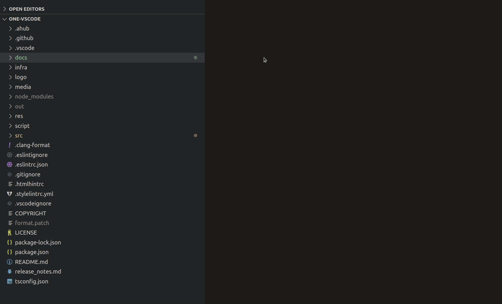

### Introduction

This pages is an introductory page for the ONE-vscode developers who want to try for the first time.

### Simple explanation on development environment
VSCode is a NodeJS project as it is built with the `electron` framework.
`electron` is a popular framework built on NodeJS. The familiar services as 'notion' or 'slack' are built on it, too.

You need to first install Node Package Manager(`npm`). Please find `package.json` file in the root directory of this project. It has all the dependencies as long as the other major configuration of this project. In 'devDependencies' section, you can see that it includes @types/node and @types/vscode. 

If you hit F12 on `import * as vscode from "vscode"` line, you can enter index.d.ts which has definitions of all vscode APIs you need. The documentation in comment is helpful enough sometimes, but to find more detailed description, go to [VSCode's official API page](https://code.visualstudio.com/api).

### How to build the extension and debug?

1. You must have `npm`(node package manager) installed.
`npm` is a package manager like pip or apt.
Likewise python virtual env, it manages packages directory by directory.

```bash
sudo apt install npm
```

2. Clone the repository

```bash
git clone https://github.com/Samsung/ONE-vscode.git
```

3. Run `npm install`
npm will prepare dependencies in `node_modules`.

```bash
cd ONE-vscode
npm install
```

4. For debug, open the vscode window and simply Press F5.
Another vscode window will be popped up and its name is 'Extension Development Host'.

Click 'ONE' icon on the left side.

You can also try the beginner's example from ["Your First Extension" page of vscode official](code.visualstudio.com/api/get-started/your-first-extension).


### Helpful pages
- [VSCode's official API page](https://code.visualstudio.com/api)
  - Most vscode API is documented very well.
- [VSCode extension sample repository](https://github.com/microsoft/vscode-extension-samples.git)
  - You can try the sample basic extensions.