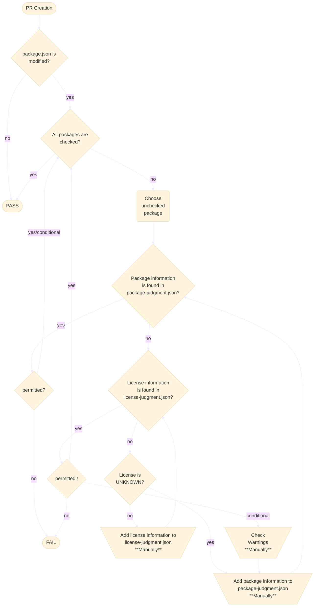

# License Verification

## Background

Numerous kinds of Node packages are needed to build and use ONE-vscode but some packages may have unacceptable license for both ONE and ONE-vscode.
Therefore we should review whether licenses of each package can be used or not.
However, if we check all of them manually, we may mistake or miss something.
To reduce such risk and labor, automatic license checker would be good solution.

## Process & Architecture

### Flowchart



### Terminology

- license-judgment.json
  - Each of license names are got from the result of `license-checker`
  - Each judgment for a license consists of following information
    ```json
    "License Name": {
        "permitted": "yes / conditional / no",
        "caution": "(Optional field) Why permitted is conditional or no"
    },
    ```
    - `permitted` : Whether a license is allowed in ONE-vscode
      - `yes` : Allowed to use
      - `conditional` : Allowed to use under specific conditions. Each package with this should be judged manually.
      - `no` : Not allowed to use
- package-judgment.json
  - Each judgment for a package consists of following information
    ```json
    "pkgname@version": {
      "licenses": "License name",
      "repository": "URL for package repository",
      "permitted": "yes / conditional / no",
      "caution": "(Optional field) Cautions when package is used"
    },
    ```
    - `permitted` : Whether a package is allowed in ONE-vscode
      - `yes` : Allowed to use
      - `conditional` : Allowed to use under specific conditions. Needed to be checked manually when release is progressed.
      - `no` : Not allowed to use

### Guideline

- Adding a license to `license-judgment.json`
  - Add license name without any modification
    - Do not remove parenthesis, `OR`, `AND` and so on
- Adding a package to `package-judgment.json`
  - Only add a package which cannot be judge only with `license-judgment.json`.
  - If a package can be judged only with license name, do not add here. Unless, we shall add thousands of package judgments here.

### Design Note

- This flow is run on Ubuntu, Windows and MacOS
  - Even same package is installed, dependent packages could be different
- Why `package-judgment.json` is needed even we have `license-judgment.json`?
  - If we only have `license-judgment.json`, following problems would be occurred
    - If license is `UNKNOWN`, how can we know the license?
    - If license is classified as `Warning`, can we judge only with license name whether it can be used or not? (e.g. `(MIT OR GPLv3)`)
    - If package cannot be used but has `Allowed` license, how can we forbid the package?
  - As a result, `package-judgment.json` includes judgments for each of packages which cannot be judged by `license-judgment.json`
- `PASS` and `FAIL` in the flowchart is the result of verification, not a result of Github Action
  - Even verification result is `FAIL`, it does not mean Github Action is failed.
  - This is because we may need to merge pull request even there are some `Warning` or `Failure`
    - When verification result has `Warning` and the package is under manual review, we cannot merge any pull requests until the manual reivew is finished. But the manual review may take more than 2~3 days.
    - When verification result was recognized and related updates are not yet applied, we cannot merge any pull requests until the updates are applied.
- `license-checker` can deduce for some unknown licenses. However, we do not use this function because we cannot assure it is always correctly deduced.

## Limitations

- This verification process is not official. It is just automated version of developer's license verification.
- This verification process is minimum insurance and thus cannot assure this tool fully covers license issues. Do not fully trust.
- This verification process only verifies installed packages, not source codes.
