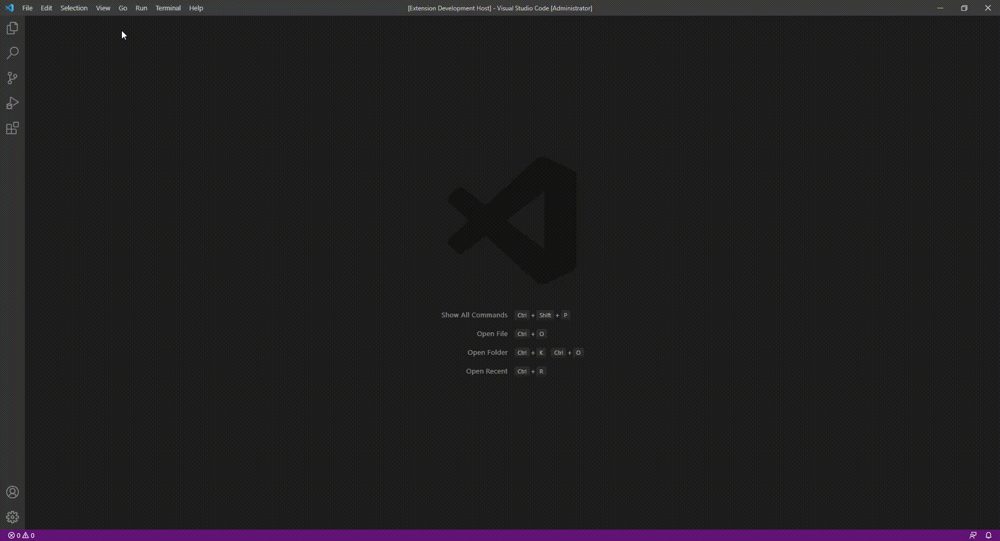
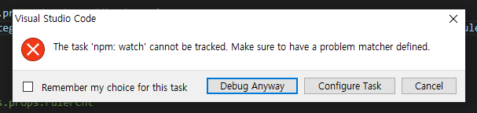

# ONE vscode extension

publisher : SSAFY TheONE


## Preview



- Click `Load`, a file selection dialog will pop up
- You can `visualize` JSON files.
- `Zoom-in/Zoom-out` is possible.
- `GPU/CPU` usage is displayed.
- You can click on the bar to see `More info`.
- You can `open/close`  the panel.


## To be developed

- Changed to responsive scale when zooming in/out
- Fixed left bar
- Bar multi-selection (individual multi-selection, section dragging)
- Make the color a bit prettier
- Capture


## Discussion

- Shall we change to dark mode?


## Run locally

Type `yarn` to create `node_modules`. 

Type `yarn watch-build` to create `build`.  If this message appears during the build process, `[nodemon] clean exit - waiting for changes before restart`, exit the build with `ctrl + c`.

After that, you can run the `vscode extension` by pressing the `F5` key. Press `ctrl + shift + P` in the newly opened VScode and enter the command below to auto complete.

The following warning message may be output. Just press `Debug anyway` and proceed.




### run

```
$ yarn
$ yarn watch-build
```


### command

```
ONE:one-vscode-barchart
```

